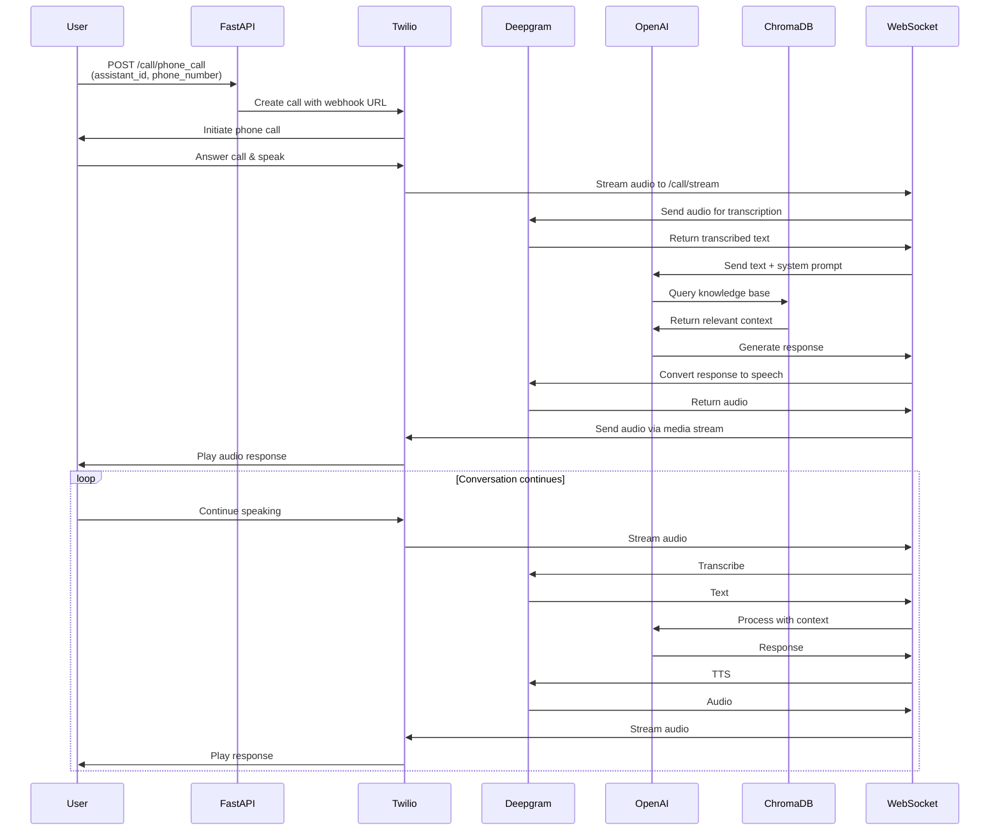
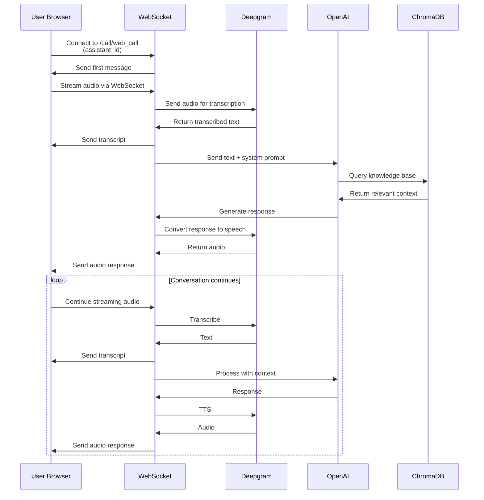
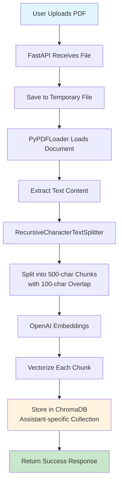
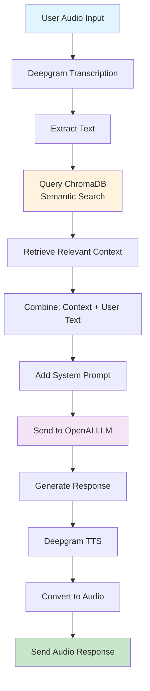
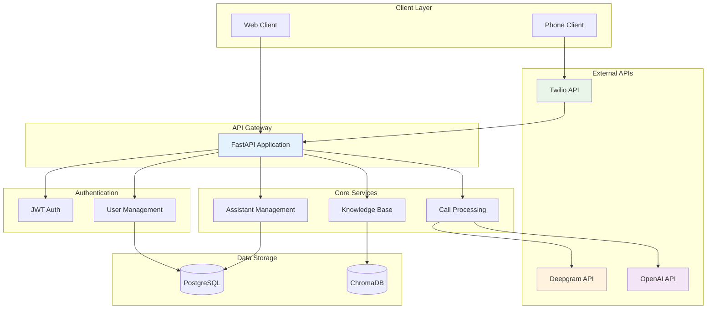
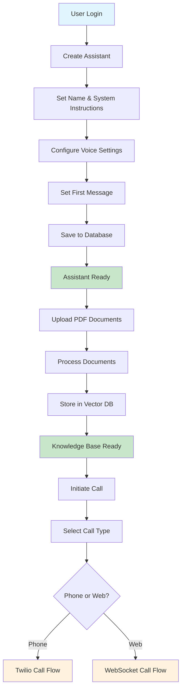
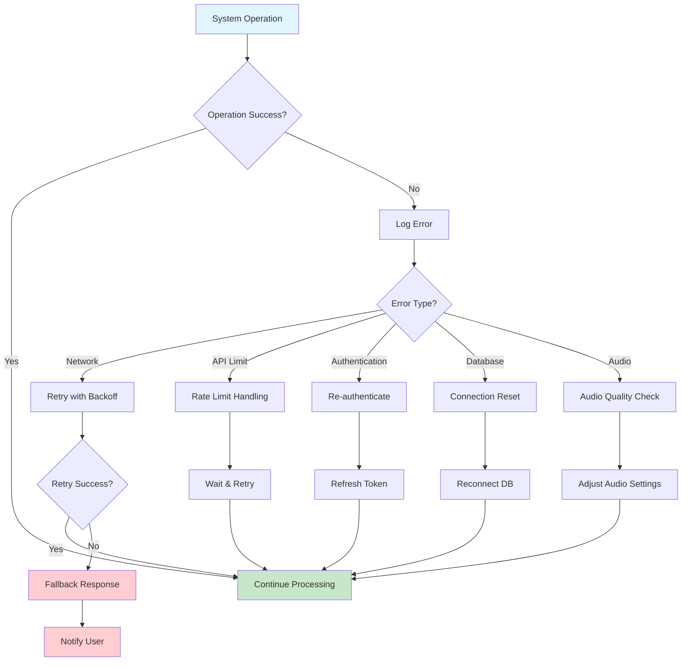
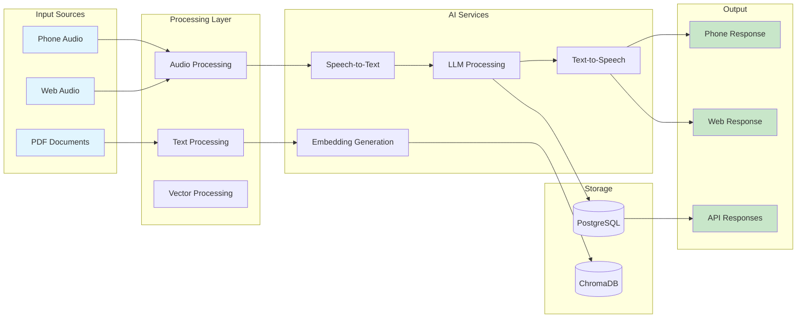

# Voice AI Backend - Flow Diagrams

## 1. Phone Call Flow Diagram

## 2. Web Call Flow Diagram

## 3. Knowledge Base Processing Flow

## 4. Response Generation Flow

## 5. System Architecture Flow

## 6. Assistant Creation and Management Flow

## 7. Error Handling and Recovery Flow

## 8. Data Flow Architecture

These flow diagrams provide a comprehensive visual representation of how your Voice AI Backend system works, including:

1. **Phone Call Flow**: Complete sequence from call initiation to response
2. **Web Call Flow**: Real-time WebSocket-based communication
3. **Knowledge Base Processing**: PDF upload and vectorization process
4. **Response Generation**: AI processing pipeline
5. **System Architecture**: Overall system components and relationships
6. **Assistant Management**: Creation and configuration flow
7. **Error Handling**: Robust error management strategies
8. **Data Flow**: End-to-end data processing architecture

Each diagram uses different visual styles (sequence diagrams, flowcharts, and graphs) to best represent the different types of processes in your system. 